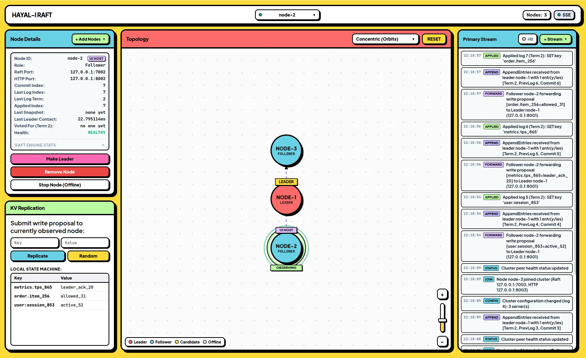
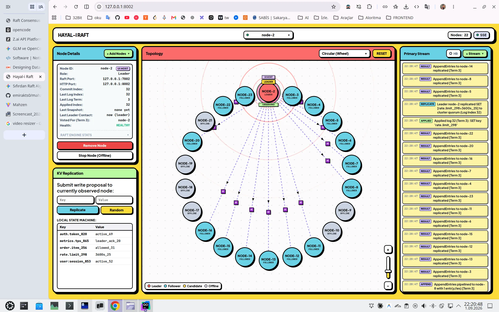
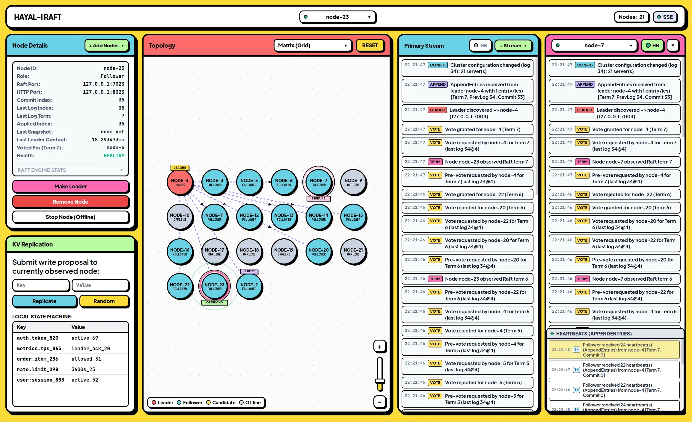
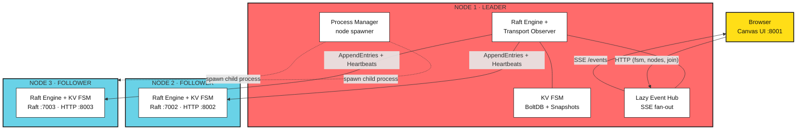

<h1 align="center">RaftCam</h1>

<p align="center">
  Watch Raft consensus think. A real Raft cluster — spawn, kill and elect nodes live, visualized on a Neobrutalism canvas.
</p>

<div align="center">

[](https://go.dev)
[](https://github.com/hashicorp/raft)

</div>

## Overview

> Each node is a separate OS process running real Raft consensus with a key-value FSM and BoltDB-backed storage. Adding or removing a node is not a canvas trick — a new process actually starts and joins the cluster through real membership changes, and a removed node is deregistered and shut down. A transport-level wrapper instruments every RPC — heartbeats, votes, append entries, snapshots, leadership transfers — and streams them to the browser over SSE.

## Features

- **Nothing Is Simulated** - Every animation on screen is driven by a real Raft RPC: heartbeats, votes, log replication, snapshots, leadership transfers
- **Multi-Vantage Streaming** - Watch 2-4 nodes at once; each stream shows that node's subjective view of the world
- **Concentric Canvas Topology** - Leader at the center, followers on auto-arranged rings with collision-repulsion physics.
- **Live Cluster Management** - Spawn +1/+5/+10/+20 real node processes from the UI, remove them with graceful membership change + process shutdown
- ...

## Quick Start

```bash
make start
```

Builds the binary, bootstraps a 3-node cluster and wipes old data. Open any node:

- Node 1: http://localhost:8001
- Node 2: http://localhost:8002
- Node 3: http://localhost:8003

```bash
make stop    # stop the cluster
make test    # run tests
make clean   # stop + remove bin/ data/ logs/
```

## Screenshots

<div style="display: flex; justify-content: center; gap: 10px; flex-wrap: wrap;">
  
  
  
</div>

## API

| Method | Endpoint | Description |
|---|---|---|
| `GET` | `/` | Embedded web UI |
| `GET` | `/state` | Full cluster state snapshot from this node's perspective |
| `GET` | `/events` | Live SSE event stream |
| `POST` | `/join` | Join a node to the cluster |
| `POST` | `/remove` | Remove a node from the cluster |
| `POST` | `/leader/transfer` | Transfer leadership |
| `POST` | `/fsm/set` | Replicate a KV write through consensus |
| `GET` | `/fsm/data` | List applied FSM data |
| `POST` | `/nodes` | Spawn nodes (`{"count": 10}`) |
| `DELETE` | `/nodes/{id}` | Remove node and kill its process |
| `POST` | `/nodes/{id}/stop` | Stop a node process (failover testing) |

## Architecture



One binary, one flag set per node: `-node-id`, `-raft-addr`, `-http-addr`, `-bootstrap` / `-join-addr`. The bootstrap node starts solo; everyone else joins through its HTTP API.

---

<p align="center">
  <a href="mailto:emirakts0@gmail.com">emirakts0@gmail.com</a>
</p>
